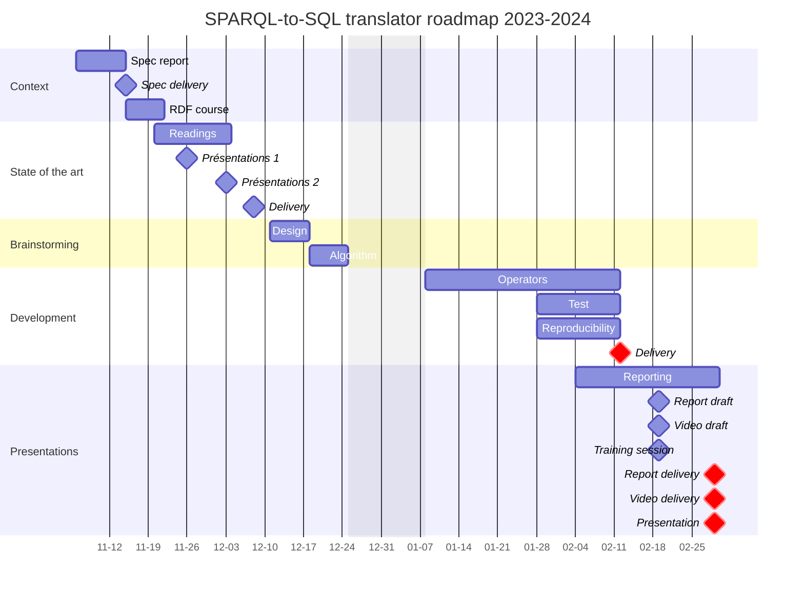

# Thesis. Urban Knowledge Hub for Evolving Cities

The description of this thesis is published on [my LIRIS page](https://liris.cnrs.fr/en/thesis/thesis-jey-puget-gil). 

## Idea
### Graph versioning
[Graph versioning for evolving urban data](https://hal.science/hal-04257528) is a key feature of the Urban Knowledge Hub for Evolving Cities. The graph versioning is made by the [SPARQL-to-SQL](https://github.com/VCityTeam/SPARQL-to-SQL) project.

### Condensed representation of the versioning
Our proposition is to use a vector of bits to represent the data versioning. Each bit represents the existence of the data inside the associated version.
A graphic representation of the versioning is available [in the poster](https://hal.science/hal-04257528).

## Organization
### Roadmap

### Kanban

The Kanban is available on [the SPARQL-to-SQL fork](https://github.com/orgs/jpg-research/projects/2).